## **Proteria Web AES**

### Allgemeines:

#### Menü:

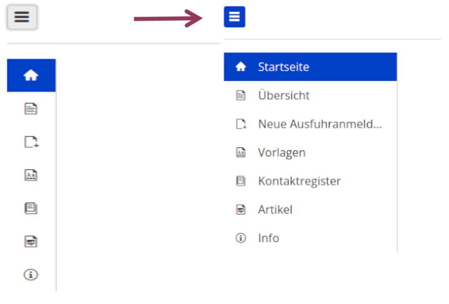1. Übersicht:

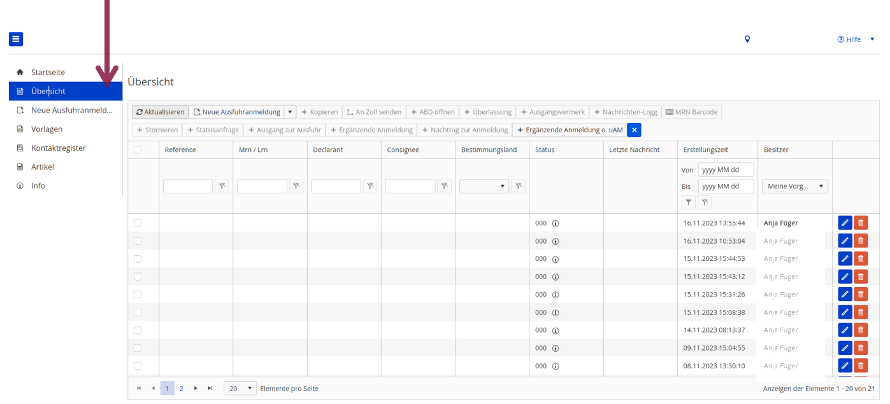1.1. Neue Ausfuhranmeldung mit oder ohne Vorlage:

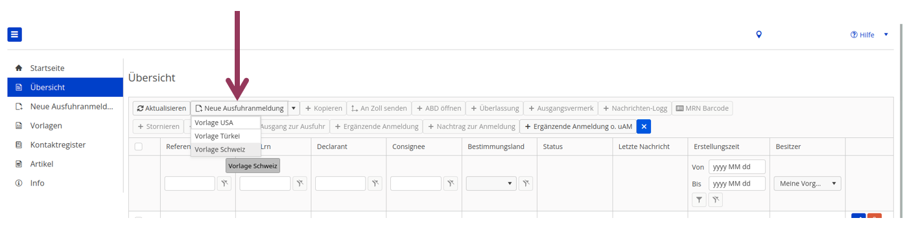1.2. Dokument kopieren:

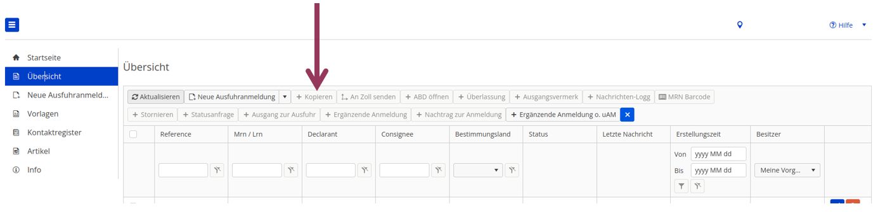Bisher:

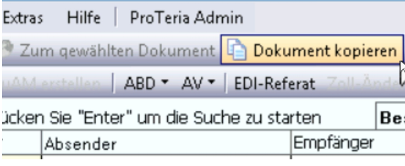1.3. ABD öffnen:

1.3. ABD öffnen:

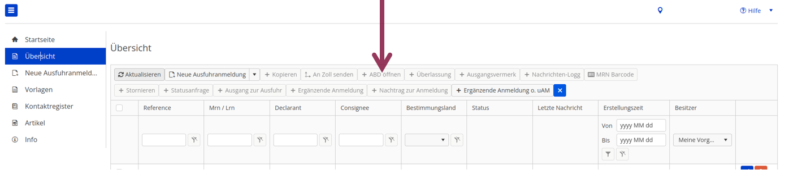Bisher:

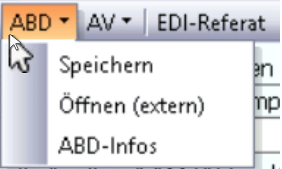1.4. Überlassung:

ABD-Release-Daten der Ausfuhrzollstelle:

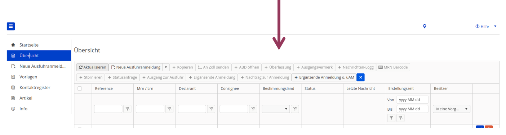Bisher:

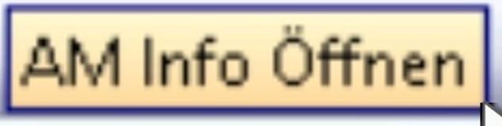1.5. Ausgangsvermerk:

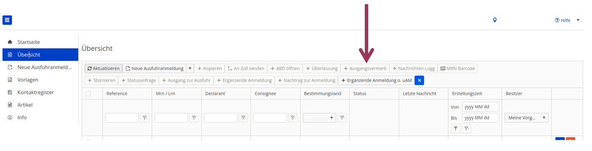1.6. Nachrichten-Log:

Bisher: EDI-Referat

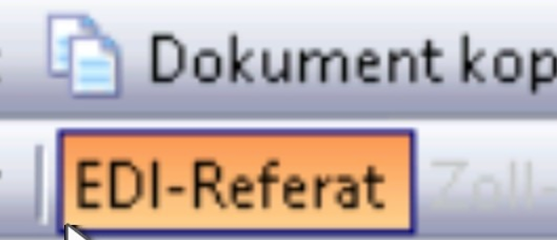1.7. MRN-Barcode:

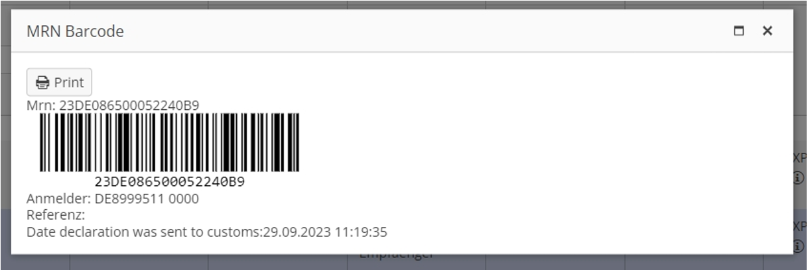Bisher:

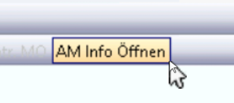1.8. Ausfuhranmeldung stornieren:

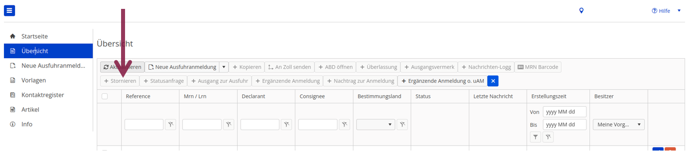Bisher:

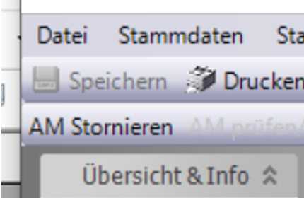1.9. Statusanfrage:

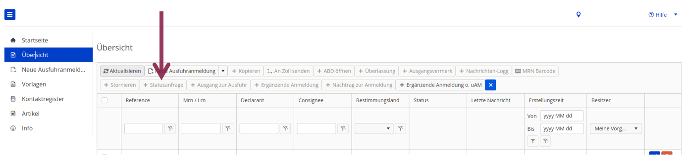Erläuterung:

In den Fällen, in denen denen die Ausgangsbestätigung/ das Kontrollergebnis zu eine m elektronischen Ausfuhrvorgang 90 Tage nach Überlassung zum Ausfuhrverfahren nicht vorliegt, wird ein Nachforschungsersuchen durch die Ausfuhrzollstelle eingeleitet.

Die Aufforderung zur Aufklärung des des Verbleibs der Ware kann bei der vorgesehenen/tatsächlichen Ausgangszollstelle mittels Statusanfrage erfolgen. Bei Eingang der Ausgangsbestätigungwird das Nachforschungsersuchen beendet.

Die Statusanfrage führt nur in seltenen Fällen zum Eingang eines Ausgangsvermerks und sollte nur in Ausnahmefällen verwendet werden.

2\.0 Ausgang zur Ausfuhr – Warenverbleib:

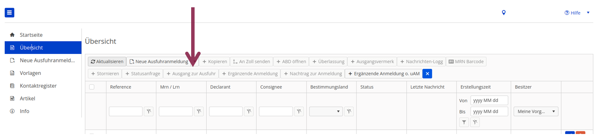2.1. Ausgangsvermerk:

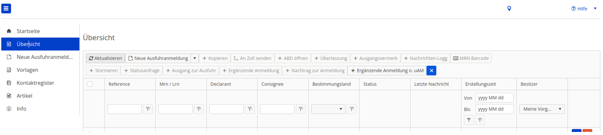Bisher:

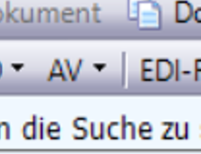2.2. Ergänzende Anmeldung:

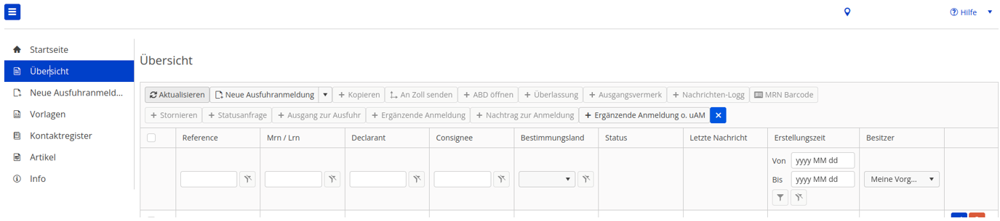2.3. Nachtrag zur Anmeldung – Nachträgliche Gestellung:

2.4. Ergäzende Anmeldung mit unvollständiger Anmeldung in Proteria:

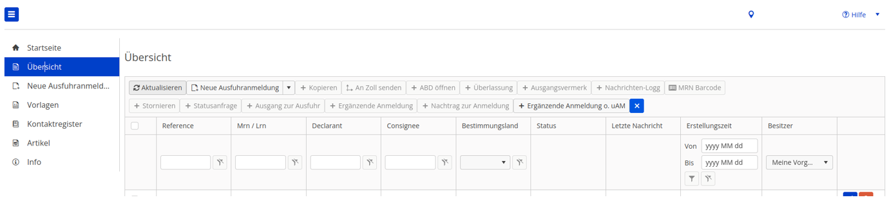2.5. Ergänzende Anmeldung (ohne unvollständige Anmeldung in Proteria:

2.6. Ansicht / Bearbeitung von Anmeldungen innerhalb der Firma:

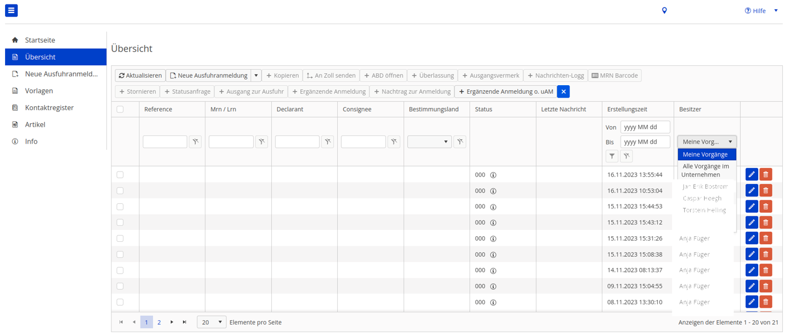2.7. Statusmeldungen in der Übersicht:

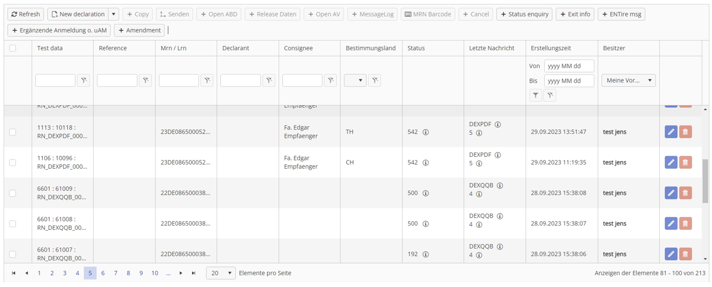Tooltip:

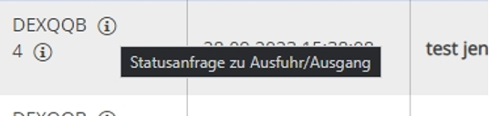Durch Anklicken des Info-Symbols werden detaillierte Informationen angezeigt.

2\.8. Suchen von Vorgängen in der Übersicht:

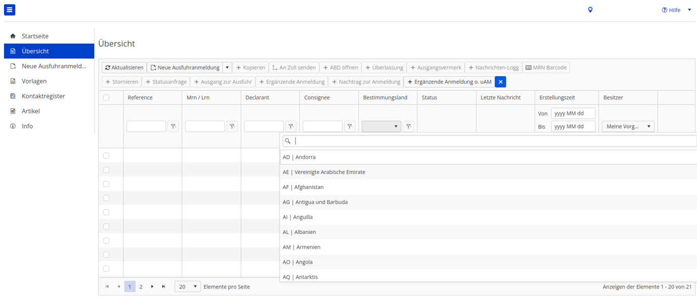2.9. Vorlagen:

Es können beliebig viele Vorlagen erstellt werden:

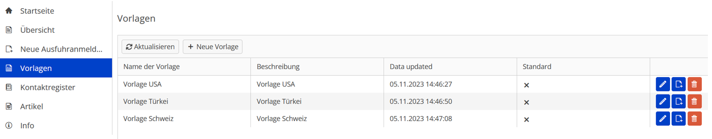3. Kontaktregister:

Verwaltung aller Kontakte:

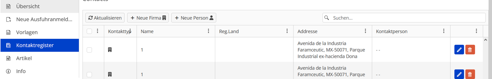Bisher:

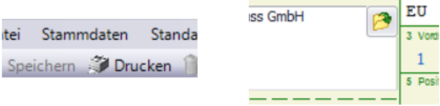3.1. Artikelregister:

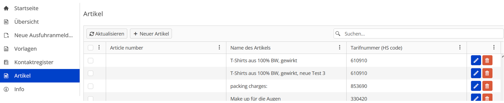Bisher:

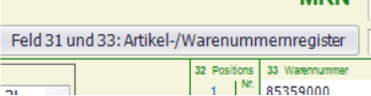3.2. Infos:

Allgemeine Infos von Proteria