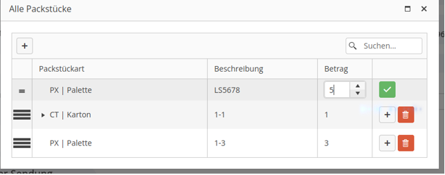
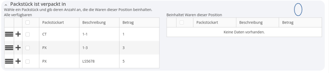
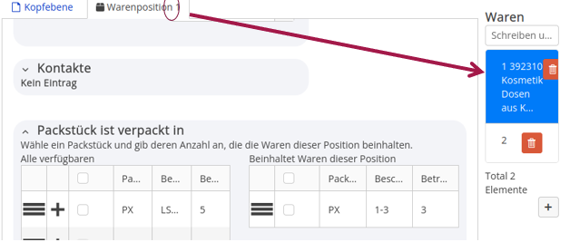
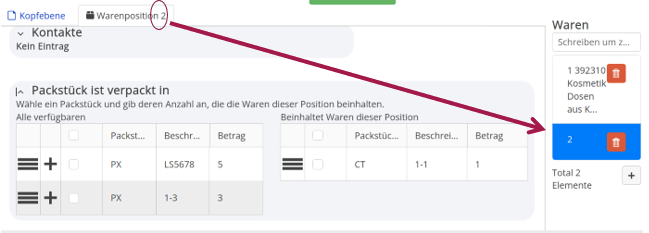

## **Eingabe von Packstücken:**

Alle vorhandenen Packstücke werden auf Kopfeben eingetragen:

Falls es sich um einen Beipack handelt:

Waren sind den Packstücken zuordenbar:

Auf Positionsebene können die Packstücke der jeweiligen Position zugeordnet werden:

Mit dem Cursor auf den Anfasser (3 horizontale Linien) gehen und mit gedrückter Maustaste in die linke Spalte zu “Beinhaltete Waren dieser Position” ziehen.

Die Zuordnung für jede Position gemäß der oben beschriebenen Vorgehensweise

