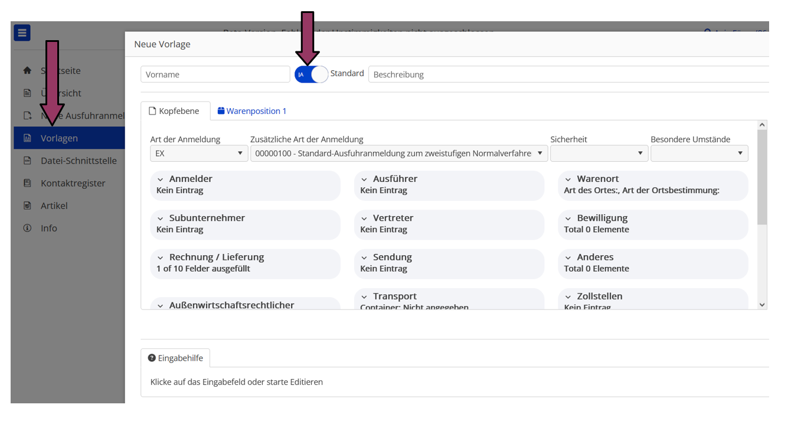
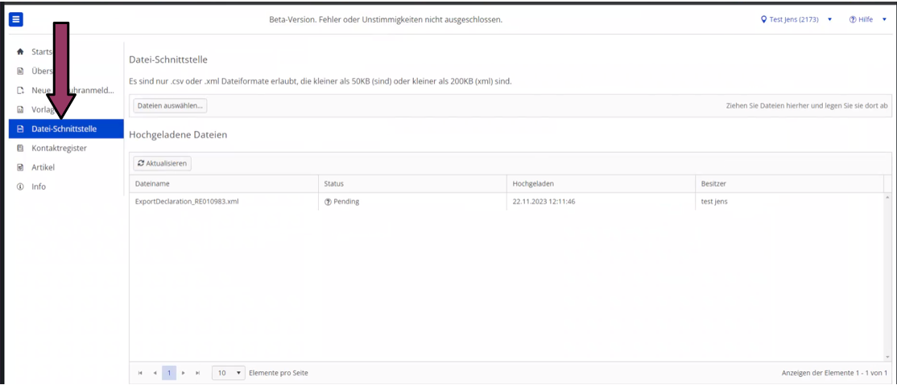

## **Datenimport über Schnittstelle:**

Links im Menü ist der Menüpunkt „Datei-Schnittstelle“ .auszuwählen.

Daten, die nicht er Datei-Import

*Bitte beachten Sie, dass die Schnittstellen noch nicht komplett angepasst wurden.*

***Datenfelder, die über die Schnittstelle noch nicht automatisch befüllt werden können, können, wie bisher, mittels Vorlage in der Anmeldung bereitgestellt werden. Bitte hinterlegen Sie diese Daten BEVOR Sie den Datei-Import starten!***

***Der Import-Prozess nimmt als Warenporitions-Vorlage immer die erste Warenposition. Alle möglichen weiteren Warenpositionen der Standardvorlage werden&amp;nbsp; beim Erstellen der Anmeldung über der Import ignoriert.***

Bitte über Menüpunkt „Vorlage“ links, eine entsprechende Vorlage erstellen.

**Bitte diese Vorlage als „Standard“ festlegen.**

Über „Dateien auswählen“ kann der Import gestartet

Unter Status erscheint eine entsprechende Meldung, sobald der Import abgeschlossen ist und die Anmeldungen in der Übersicht vorhanden sind.Sollte die hochgeladene Datei fehlerhaft sein, gibt der Info-Button bei Status eine entsprechende Rückmeldung.