## **Anmeldungen in den unterschiedlichen Verfahren:**

1.  Ausfuhranmeldung mit Antrag auf Gestellung außerhalb des Amtsplatzes

2.  Anmeldung unter Verwendung einer Bewilligung SDE (vormals „Zugelassener Ausführer“)

3.  Anmeldung mit Gestellung am Amtsplatz

4.  Anmeldung im einstufigen Verfahren

### 1. Ausfuhranmeldung mit Antrag auf Gestellung außerhalb des Amtsplatzes

Bisher: AM+c

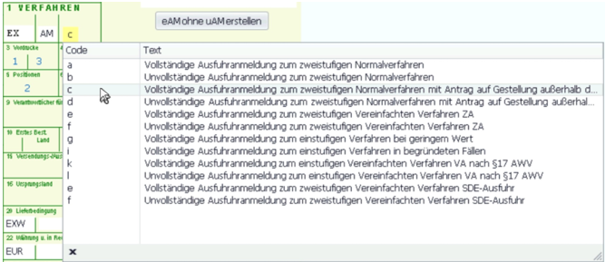Neu: Verfahren 00000210

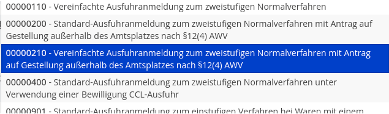Warenort / Ladeort

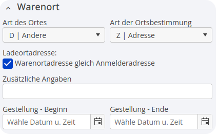Falls abweichende Ladeort-Adresse:

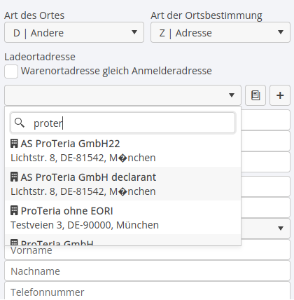2. Anmeldung unter Verwendung einer Bewilligung SDE (vormals „Zugelassener Ausführer“)

Bisher: AM+e

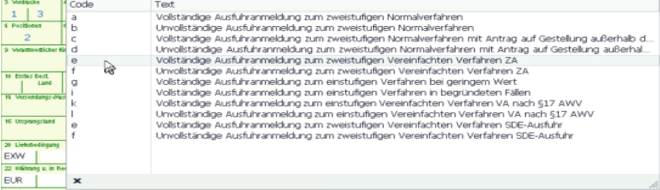Neu:

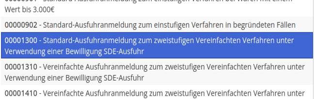Angabe der Bewilligungsnummer + Ladeort-Code:

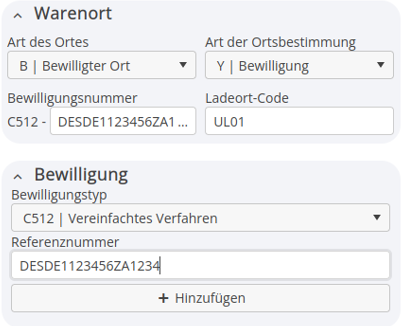3. Anmeldung mit Gestellung am Amtsplatz:

Bisher: AM+a

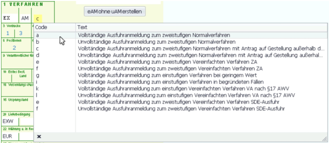Neu:

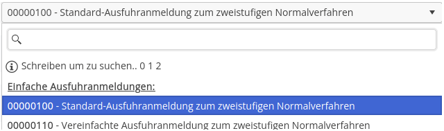Ladeort:

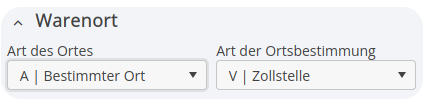4. Anmeldung im einstufigen Verfahren

Bisher: AM+g

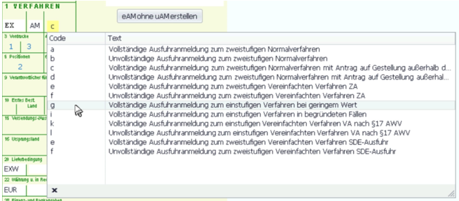Neu:

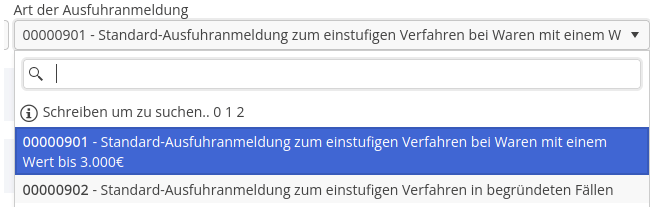Ladeort:

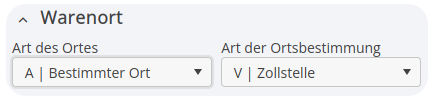